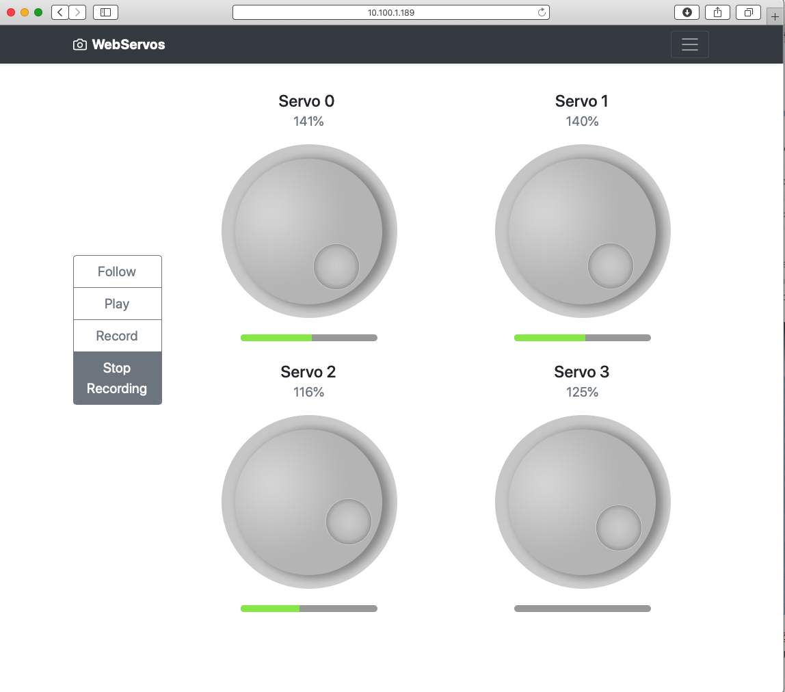

# WebServos
ESP32 Controlling analog-feedback servos.
ESP32 PlatformIO based project

Features:
* Control Multiple Servos
* Follow Dial position
* Record Phyical movement of Servos @ 0.5ms interval
* Replay last recorded sequence
* Requires Internet Access for UI
* Standalone AP Configuration `ESP32_WebServo` 

# User Interface

## ESP32 Board
LOLIN32 V1.0.0 WiFi + bluetooth Module ESP-32 4MB FLASH Development Board

#### Key Libraries

[ESP8266 & ESP32 wifi tool](https://github.com/oferzv/wifiTool)

SPIFFS oriented AsyncWebServer based wifi configuration tool.  This library was created to allow you with one include to have:

1. auto wifi connect, with up to 3 saved router/password with easy wifi configuration tool.
2. AP access when no wifi is connected with captive - for easy access.
3. SPIFFS management tool.
4. OTA over http.

[WebSocket Server and Client for Arduino](https://github.com/Links2004/arduinoWebSockets)

Library Storage: ./PlatformIO/Projects/WebServos/.pio/libdeps/lolin32
    Updating ArduinoJson                     @ 6.16.1         [Up-to-date]
    Updating AsyncTCP                        @ 1.1.1          [Up-to-date]
    Updating ESP Async WebServer             @ 1.2.3          [Up-to-date]
    Updating ESP32AnalogRead                 @ 0.0.5          [Up-to-date]
    Updating ESPAsyncTCP                     @ 1.2.2          [Up-to-date]
    Updating ServoESP32                      @ 1.0.3          [Up-to-date]
    Updating WebSockets                      @ 2.2.1          [Up-to-date]
    Updating wifi Tool                       @ b02f893        [Up-to-date]

## License

    Open source under the MIT License.